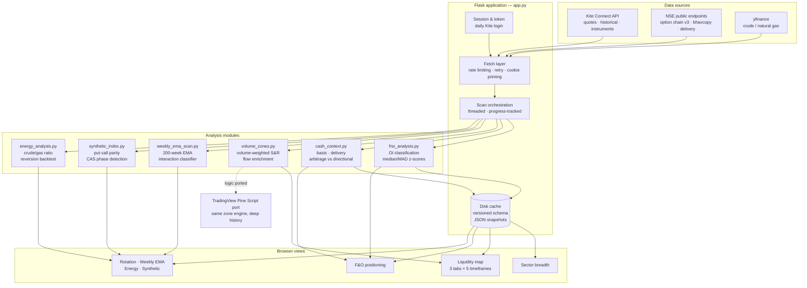
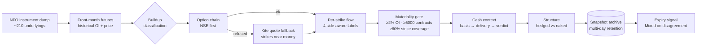

# Market Analytics Dashboard

**Indian equity and derivatives analytics platform — sector breadth, liquidity
structure mapping, and F&O positioning analysis.**

Copyright (c) 2026 Amans2bmm. All rights reserved. See [LICENSE](LICENSE) —
this is proprietary software published for review, not for reuse.

---

## What it is

A locally-hosted Flask application that reads a live Zerodha Kite Connect
account and NSE public data feeds, then renders eight analytical views in the
browser. It answers three questions a discretionary Indian equity/F&O trader
asks daily:

1. **Where is the market** — sector breadth against a selectable EMA, regime
   classification, turnover concentration, sector rotation with walk-forward
   validation.
2. **Where are the levels** — volume-weighted support/resistance zones,
   execution-liquidity metrics, and empirical reach rates, across five
   timeframes.
3. **What are positions doing** — futures buildup, option flow classification,
   and cash-and-carry arbitrage detection across the full NSE F&O universe
   (~210 underlyings).

Every scan caches to disk and runs only on explicit request — no polling, no
background rescans on page load.

---

## Architecture



### Scan pipeline (F&O positioning, the most developed path)



---

## Design decisions worth explaining

These are the choices that took the longest to get right, and the reason the
output is trustworthy rather than merely plausible.

**Raw numbers are meaningless without a reference.** Every threshold in the
system was replaced by a distribution drawn from the instrument's own history:

| Metric | Naive approach | Implemented |
|---|---|---|
| Delivery % | absolute 60/25 cut-offs | σ from the stock's own 15-session mean, plus a consecutive-above-average streak |
| Futures OI change | raw percent | **median and MAD** from that contract's own 20-day distribution |
| PCR | textbook 0.7/1.3 | percentile of that stock's own historical range |
| Option OI | single-day snapshot | multi-day direction from a persistent archive |

**Median/MAD rather than mean/SD for open interest.** Expiry rollover plants a
large outlier in every lookback window. With one 42% rollover day present, a
genuine 4.19σ move scored **0.07** — the signal was erased for a month. MAD
ignores tails by construction and scored the same move 3.31.

**Non-repainting by construction.** Liquidity zones are built only from pivots
confirmed by N subsequent bars, and walk forward in time so every zone's state
reflects only information available as bars arrived. A level that appears in
hindsight cannot be traded.

**EMA seeding.** A 200-period EMA needs far more than 200 bars to settle — with
85 settling bars, 43% of the value is still the seed. Seeded with an SMA and
chained across multiple API calls to reach ~2.5% residual seed influence.

**Failures are never silent.** A bare `except Exception: pass` hid three
separate bugs, each making a broken scan look identical to "the market has
nothing to show". Programming errors (`NameError`, `TypeError`, `KeyError`,
`AttributeError`, `IndexError`) now re-raise; only network and data faults are
tolerated, and they are counted and surfaced.

**Diagnostics before parameters.** Every unexplained output is investigated by
building a probe endpoint (`/api/version`, `/api/probe-fno`,
`/api/probe-option-chain`, `/api/probe-universe`) rather than by adjusting
constants on a hypothesis.

---

## Known limitations — stated, not hidden

The application states each of these in its own interface:

- **Open interest cannot identify participants.** Every contract has a buyer
  and a seller in equal number. Real attribution needs NSE's participant-wise
  file, which is end-of-day only and on no broker API.
- **OI plus premium shows who won on price, not who was aggressive.** Passive
  buyers absorbing aggressive sellers look identical to aggressive buying in
  this data. Only tick-level order flow separates them.
- **Confidence percentages are hand-assigned judgement, not measurement.**
  Nothing in the classification layer is backtested. The empirical reach rates
  are the only measured probabilities in the system.
- **Delivery excludes intraday correctly, but not MTF, BTST, or the cash leg
  of arbitrage** — all of which take delivery. No public MTF feed exists.
- **Structural liquidity zones are retail/SMC methodology**, not institutional.
  Institutions measure execution liquidity — Amihud impact, Corwin-Schultz
  spread estimation, ADV capacity. Both are implemented and the distinction is
  stated on the page.

---

## Stack

`Python 3.10+` · `Flask` · `kiteconnect` · `pandas` · `requests` · `yfinance`
· vanilla JS front end (no framework) · `Pine Script v5` for the TradingView
port.

No database — versioned JSON caches on disk, chosen because the working set is
small, the schema evolves frequently, and every cache is disposable by design.

---

## Running it

Requires a Zerodha Kite Connect subscription with historical data enabled, and
a `credentials.txt` holding the API key and secret (never committed — see
`.gitignore`).

```bash
pip install -r requirements.txt
python app.py
# open http://127.0.0.1:5000 and complete the Kite login (required once per trading day)
```

---

## Licence

Proprietary. All rights reserved. This repository is published so the work can
be **reviewed**; it grants no permission to copy, adapt, redistribute, or
create derivative works. See [LICENSE](LICENSE) for the full terms.
